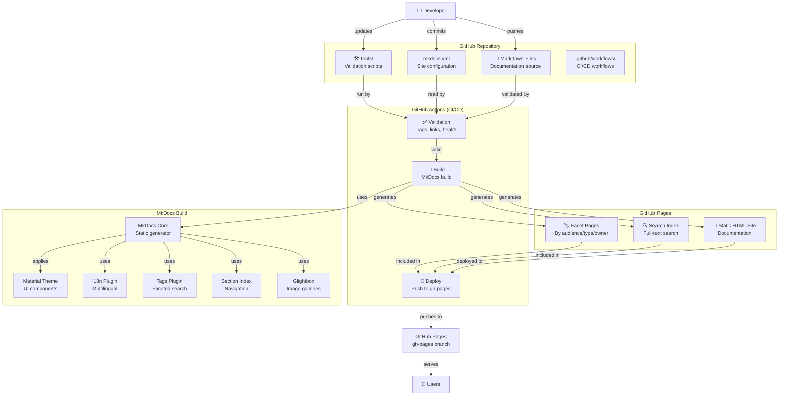

# Container Diagram (C4 Level 2)

Detailed view of Accor DocOps platform containers (deployment units).

## Diagram

## Containers

### 1. GitHub Repository

- **Technology:** Git version control
- **Purpose:** Stores documentation source code
- **Contains:**
  - Markdown files (`docs/en/`, `docs/fr/`)
  - Configuration (`mkdocs.yml`)
  - Validation tools (`tools/`)
  - CI/CD workflows (`.github/workflows/`)
- **Responsibilities:**
  - Version control
  - Collaboration (PR workflow)
  - Source of truth

### 2. GitHub Actions (CI/CD)

- **Technology:** GitHub Actions YAML workflows
- **Purpose:** Automated validation, building, and deployment
- **Components:**
  - **Validation:** Runs `tools/validate_tags.py`, `check_links.py`, etc.
  - **Build:** Executes `mkdocs build`
  - **Deploy:** Pushes built site to `gh-pages` branch
- **Responsibilities:**
  - Quality assurance
  - Automated deployment
  - PR previews

### 3. MkDocs Build Process

- **Technology:** Python + MkDocs framework
- **Purpose:** Generates static HTML from Markdown
- **Core Components:**
  - **MkDocs Core:** Markdown → HTML conversion
  - **Material Theme:** UI/UX components
  - **Plugins:**
    - `mkdocs-static-i18n`: Multilingual support
    - `mkdocs-tags`: Tag-based faceting
    - `mkdocs-section-index`: Navigation improvements
    - `mkdocs-glightbox`: Image galleries
- **Responsibilities:**
  - Markdown parsing
  - Theme rendering
  - Plugin integration
  - Static site generation

### 4. GitHub Pages (Static Site)

- **Technology:** Static HTML/CSS/JavaScript
- **Purpose:** Serves documentation to end users
- **Components:**
  - **Static HTML:** Rendered pages
  - **Search Index:** Lunr.js index for full-text search
  - **Facet Pages:** Generated pages for filtering (by audience, type, owner)
- **Responsibilities:**
  - Content delivery
  - Search functionality
  - Navigation and filtering

## Technology Stack

| Container | Technology | Purpose |
|-----------|-----------|---------|
| Repository | Git | Version control |
| CI/CD | GitHub Actions | Automation |
| Generator | MkDocs (Python) | Static site generation |
| Theme | Material for MkDocs | UI framework |
| Hosting | GitHub Pages | Static hosting |
| Search | Lunr.js | Client-side search |

## Data Flow

1. **Developer** commits Markdown files to repository
2. **GitHub Actions** triggers on push/PR
3. **Validation** scripts check tags, links, front matter
4. **Build** process runs MkDocs with plugins
5. **Static site** generated in `site/` directory
6. **Deploy** pushes `site/` to `gh-pages` branch
7. **GitHub Pages** serves static files
8. **Users** access via web browser

## Communication Patterns

- **File-based:** Documentation stored as files, not database
- **Pull-based:** Users access via HTTP (GitHub Pages)
- **Event-driven:** CI/CD triggered by Git events (push, PR)
- **Stateless:** No server-side state, pure static files

## Deployment

- **Source:** `main` branch (or feature branches for PRs)
- **Target:** `gh-pages` branch (GitHub Pages serves from here)
- **Trigger:** Automatic on merge to `main`, manual for PRs
- **Frequency:** Every merge to `main` branch

## Next Level

For component-level details (within MkDocs), see individual plugin documentation or source code.

---

**Last Updated:** 2025-01-15

