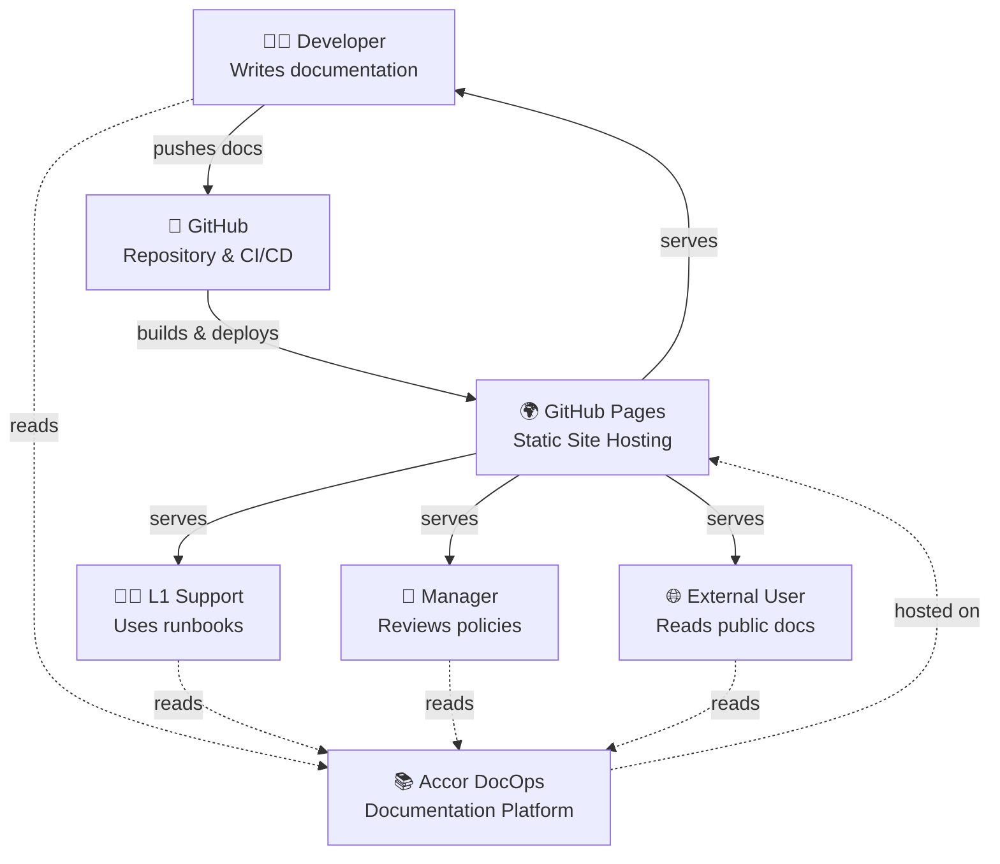

# System Context Diagram (C4 Level 1)

High-level overview of Accor DocOps platform and its users.

## Diagram

## Actors

### Developers

- **Role:** Content creators and maintainers
- **Needs:** Easy to write, preview changes locally, automated validation
- **Interactions:**
  - Push Markdown files to GitHub
  - Preview changes locally (`mkdocs serve`)
  - Receive feedback from CI/CD on PRs

### L1 Support

- **Role:** First-line support operators
- **Needs:** Quick access to runbooks, troubleshooting guides
- **Interactions:**
  - Search documentation by topic
  - Filter by audience (l1-support)
  - Access runbooks for incident response

### Managers

- **Role:** Decision makers, policy reviewers
- **Needs:** Overview of processes, policies, governance
- **Interactions:**
  - Review ITIL processes
  - Check governance documentation
  - Monitor documentation health

### External Users (Optional)

- **Role:** External stakeholders, vendors
- **Needs:** Access to public documentation
- **Interactions:**
  - Read public-facing documentation
  - Access specific sections based on permissions

## System Boundaries

**Accor DocOps** is:

- ✅ Documentation repository (Markdown files)
- ✅ Static site generator (MkDocs)
- ✅ Search and navigation system
- ✅ CI/CD pipeline for validation and deployment

**Accor DocOps** is NOT:

- ❌ Content management system (no web editing)
- ❌ User authentication system (handled by GitHub)
- ❌ Comment system (no user-generated content)
- ❌ Analytics platform (separate if needed)

## External Systems

### GitHub

- **Purpose:** Version control and CI/CD
- **Interaction:**
  - Stores documentation source (Markdown)
  - Runs GitHub Actions workflows
  - Hosts repository

### GitHub Pages

- **Purpose:** Static site hosting
- **Interaction:**
  - Serves built HTML site
  - Provides HTTPS automatically
  - Handles custom domains (if configured)

## Data Flow

1. **Developer** writes documentation in Markdown
2. **Developer** pushes to GitHub repository
3. **GitHub Actions** (CI/CD) validates and builds site
4. **GitHub Actions** deploys to GitHub Pages
5. **GitHub Pages** serves static site
6. **Users** (Developers, L1 Support, Managers) read documentation via browser

## Security Context

- **Authentication:** Handled by GitHub (for editing)
- **Authorization:** Repository permissions control who can edit
- **Public Access:** Documentation site is public (or org-only based on repo settings)
- **Sensitive Content:** Marked with `sensitivity:confidential` or `sensitivity:restricted` tags

## Next Level

For detailed component view, see [Container Diagram](./containers.md).

---

**Last Updated:** 2025-01-15

