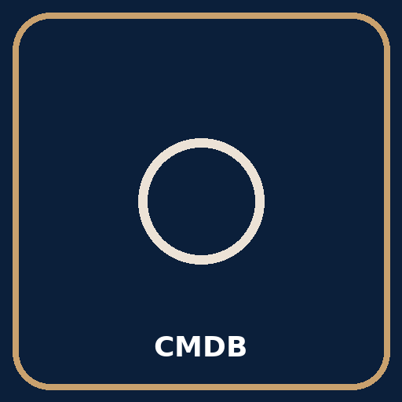

## Overview
Purpose, scope, and roles of **Configuration Management (CMDB)**.

## Standard Operating Procedures

- Link to runbooks in `/en/ops`
- Link to policies in `/en/governance`

## KPIs

- MTTR, time-to-restore, change success rate (as applicable)

