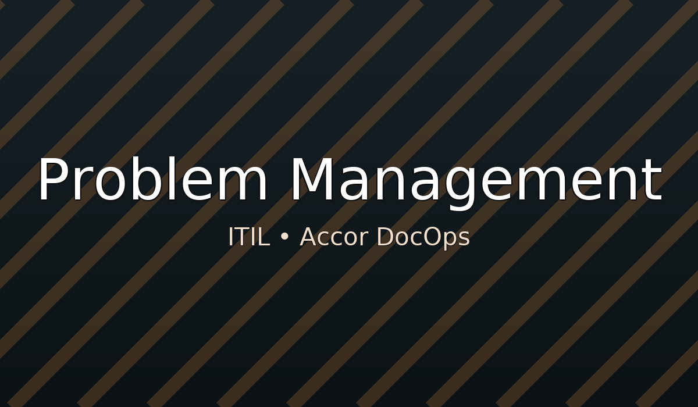

## Overview
Purpose, scope, and roles of **Problem Management**.

## Standard Operating Procedures
- Link to runbooks in `/en/ops`
- Link to policies in `/en/governance`

## KPIs
- MTTR, time-to-restore, change success rate (as applicable)

