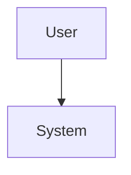

## Overview

Describe the system/service, its purpose, and key components.

## Architecture Diagram

Or reference an image:

## Components

### Component 1
- Purpose
- Responsibilities
- Interfaces

### Component 2
- Purpose
- Responsibilities
- Interfaces

## Data Flow

Describe how data flows through the system.

## Interfaces

### APIs
- REST API endpoints
- gRPC services
- Message queues

### External Integrations
- Third-party services
- Dependencies

## Deployment

- Where it runs (Kubernetes, bare metal, etc.)
- Scaling strategy
- Environment specifics

## Related Documentation

- [ADR-XXX: Decision](./../governance/architecture/decisions/)
- [Runbook](./../ops/)
- [Deployment Guide](./../devops/)
